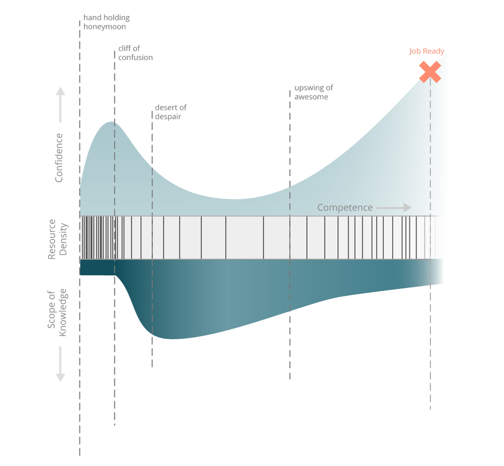

# Front End Grit: A Developer Mindset

## Table Of Contents

 * [Indroduction](#introduction)
 * [References](#introduction)
 * [Letter To Future Self](#letter)
 * [Goals](#goals)

## Foreword
Due to a Udacity bug noted in
[this pdf](https://github.com/carltonwin8/fewdProject1/blob/master/submissionError.pdf)
this is the second time this project is being submitted.
The link for the first submission review/result is at the
end of the pdf.

## Introduction 
This document is written for the first assignment/project of the
[Udacity](http://www.udacity.com/)
[Front-End Web Developer Nanodegree](https://www.udacity.com/course/front-end-web-developer-nanodegree--nd001).

The document is written in markdown using the
[Atom](http://atom.io) editor with the preview page open (ctrl-shift-m) so
that the real time rendering of the markdown is seen as one types.
The markdown that makes up this text can also be viewed on
[GitHub](http://github.com)
by clicking
[here](https://github.com/carltonwin8/fewdProject1).
Github pages also serves this content and can be view
[here](https://carltonwin8.github.com/fewdProject1).

## References 
I read the three documents suggested and am linking them
here for future reference.

 * [How To Navigate the Up and Downs Of Learning To Code](http://www.codeconquest.com/blog/how-to-navigate-the-up-and-downs-of-learning-to-code/)
 * [My First Month Coding: An Emotional Roller Coaster](http://blog.thinkful.com/post/98829096308/my-first-month-coding-an-emotional-roller-coaster)
 * [Optional: Why Learning to Code is So Damn Hard](https://www.vikingcodeschool.com/posts/why-learning-to-code-is-so-damn-hard)

## Letter To Future Self 

In this section I answer the question posed in the project's instruction section.

<dl>

<dt>Reflect on what your journey will be like as you develop your skills?<dt>
<dd>
The coding journey will go through a honeymoon/hand-holding
phase, then a confusion phase, then a despair and and finally mastery/awesome
phase.
This cycle will repeat periodically due to learning new tools and technology.
</dd>

<dt>How I can overcome any challenge ahead in the Nanodegree?<dt>
<dd>
When a challenge is encountered be persistent, work on it a bit everyday,
develop my skills through practices and keep in mind the growth
mindset discussed below.
</dd>

<dt>When you are stuck. How will you solve your problem?<dt>
<dd>I will look
for problem specific help on-line at Google, stack-overflow and the Udacity
support groups/forums.</dd>

<dt>When you are stuck.
What skills do you have now that will help you tackle challenges?<dt>
<dd>
When stuck on a problem for hours don't just mindlessly continue struggling but
walk away, take a break, do a different activity, refresh yourself and then
come back to the problem. After the break your fresh eyes will help you
approach the problem in a different light.
</dd>

<dt>How will having a growth mindset help you reach your goal?<dt>
<dd>
Having a growth mindset will help reach my goal by embracing failure
as a learning experience and using it as a motivator for action instead of
focusing on feelings of inadequacy, anxiety or a slow learning pace.
Don't tally up success and setbacks but focus on the things you learned
today and the things you will be learning tomorrow.
Look as others that are farther along than yourself as inspiration to
yourself by noting how their hard-work and persistence has rewarded
them and you too can reap the same benefits.
 Focusing on the benefits will help make your learning enjoyable.
</dd>

</dl>

A graph that I find particularly interesting is shown below and is
discussed in detail in the third article in the reference section above.
It adds the resource density and scope of knowledge to the traditional
confidence graph.
Read the article for a detail explanation of the graph.
It is interesting to note how your resource and scope of knowledge changes
as you learn.
Knowing this one can prepare for the challenges ahead.

## Goals 
The following text list the technologies *du jour* that I am interested in
learning during or after this
[Front-End Web Developer Nanodegree](https://www.udacity.com/course/front-end-web-developer-nanodegree--nd001)
in order to achieve my goals and projects.

### Front-End 
Produce a website with one or more of the following technologies.

  * [JQuery](https://jquery.com/)
  * [Bootstrap](http://getbootstrap.com/)
  * [Polymer](https://www.polymer-project.org/1.0/)
  * [Angular 2.0](https://angular.io/)

### Back-End 
Produce a back-end with one or more of the following technologies.

  * [nodejs](https://nodejs.org/en/)
  * [meteor](https://www.meteor.com/)
  * [Digital Ocean](https://www.digitalocean.com/)
  * [Google App Engine](https://cloud.google.com/appengine/docs)
  * [Firebase](https://www.firebase.com/)
  * [MongoDB](https://www.mongodb.org/)

### Mobile 
Use HTML, CSS and JavaScript skills to develop mobile applications using
one of the following tools.

  * [ionic](http://ionicframework.com/)
  * [Cordova](https://cordova.apache.org/)
  * [NativeScript](https://www.nativescript.org/)

### Projects
After learning

 * HTML, CSS and JavaScript,
 * [Front-End](#frontEnd) technology,
 * [Back-End](#backEnd) technology and
 * [Mobile](#mobile) technology.

My goal is to produce the following web and mobile applications:

 * A pill and vitamin usage tracker.
 * A exercise tracker.

I have other projects in mind but this seems enough for now.

Cheers,
Carlton.
